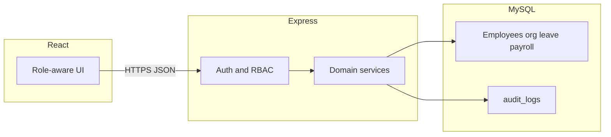
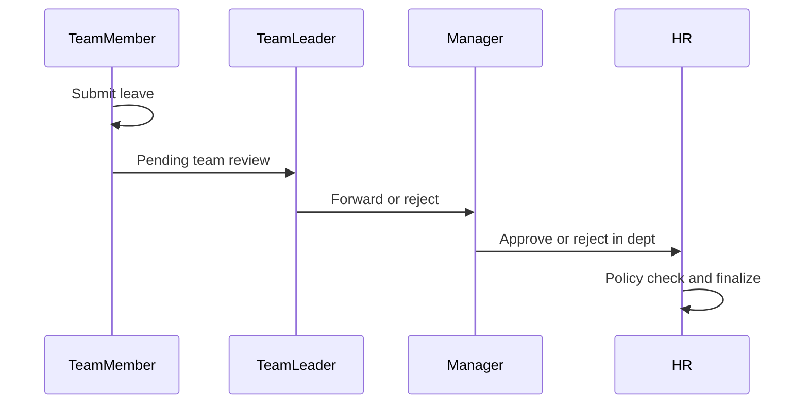

# TWM HRMS architecture

Foundation for employee management: React, Express, Node.js, and MySQL. This document locks **roles, security, data model, and local database** so features can land later without a rewrite.

## Goals

- **Accurate**: one source of truth per employee, payroll, and leave; append-only audit for money and status changes.
- **Secure**: least privilege by role **and** org scope (self, team, department, company).
- **Scalable**: stateless API, indexed MySQL, pagination; Redis and workers can be added without schema churn.

## Stack

| Layer | Choice | Why |
| --- | --- | --- |
| UI | React + Vite + TypeScript | Typed contracts reduce payroll and leave mistakes |
| API | Node.js + Express + TypeScript | Shared DTOs with the UI |
| DB | Native MySQL 8 or MariaDB on localhost | ACID, InnoDB, foreign keys; see [local-setup.md](local-setup.md) |
| Access | Prisma or Knex, parameterized queries | No string-built SQL |
| Auth | Short-lived JWT (access) + httpOnly refresh cookie | Revocable sessions; no tokens in `localStorage` |

Optional later: Redis (rate limit, refresh denylist), job queue (payslip PDF, bulk import).



## Organization and four roles

Every request is checked as:

1. **Role** — what kind of action is allowed
2. **Scope** — whose data (self, team, department, company)

| Role | Typical scope | Authority |
| --- | --- | --- |
| `team_member` | Own employee record | Profile, own leave requests, own payslips (read) |
| `team_leader` | Direct reports (team) | Team leave visibility; first-level leave recommend/approve; no other people’s payroll amounts |
| `manager` | Department / reporting tree | Leave decisions in scope; org reports; no payslip create or payment run unless also HR |
| `hr` | Company | Employee master data, salary structures, payslips, payment runs, leave policy, final/override leave, user provisioning |

HR is the only role that creates salary bases, payslips, and payment runs.

Leave is a **chain**. Persist every step on `leave_approvals`:



Steps can be skipped later if there is no team leader. v1: **one primary role per user**. Dual hats (manager + HR) are modeled as `hr` with extra manager scope or two assignments — not overlapping wildcards.

Reporting line: `employees.manager_id` (self-FK). Team leaders sit on `teams.leader_employee_id`. Scope queries walk indexed FKs.

## Permission model

Do not scatter `if (role === 'hr')` on every route.

- Tables: `roles`, `permissions`, `role_permissions`
- Middleware: authenticate → load permissions → authorize **action + resource scope**
- UI hides buttons from the same codes; the API always enforces

### Seed permission codes

| Code | Meaning |
| --- | --- |
| `employee:read:self` | Read own employee profile |
| `employee:read:team` | Read profiles in team scope |
| `employee:read:department` | Read profiles in department scope |
| `employee:read:company` | Read any employee |
| `employee:write:company` | Create/update employee master data |
| `leave:create:self` | Submit own leave |
| `leave:read:self` | Read own leave |
| `leave:read:team` | Read team leave |
| `leave:read:department` | Read department leave |
| `leave:read:company` | Read all leave |
| `leave:approve:team` | First-level team leave decision |
| `leave:approve:department` | Manager leave decision |
| `leave:approve:company` | HR finalize / override |
| `leave:policy:write` | Leave types and policy |
| `payroll:read:self` | Own payslips |
| `payroll:write:company` | Salary structures, payslips, payment runs |
| `user:provision:company` | Create/deactivate logins |
| `audit:read:company` | Read audit log |

### Role to permission matrix

| Permission | team_member | team_leader | manager | hr |
| --- | --- | --- | --- | --- |
| `employee:read:self` | yes | yes | yes | yes |
| `employee:read:team` | | yes | yes | yes |
| `employee:read:department` | | | yes | yes |
| `employee:read:company` | | | | yes |
| `employee:write:company` | | | | yes |
| `leave:create:self` | yes | yes | yes | yes |
| `leave:read:self` | yes | yes | yes | yes |
| `leave:read:team` | | yes | yes | yes |
| `leave:read:department` | | | yes | yes |
| `leave:read:company` | | | | yes |
| `leave:approve:team` | | yes | yes | yes |
| `leave:approve:department` | | | yes | yes |
| `leave:approve:company` | | | | yes |
| `leave:policy:write` | | | | yes |
| `payroll:read:self` | yes | yes | yes | yes |
| `payroll:write:company` | | | | yes |
| `user:provision:company` | | | | yes |
| `audit:read:company` | | | | yes |

New features add permission rows, not a new role system.

## Data model sketch

MySQL, InnoDB, `utf8mb4`. Soft-status employees; never hard-delete people with payroll history.

| Table | Role |
| --- | --- |
| `users` | Login, password hash (Argon2id or bcrypt), `is_active`, `must_reset_password`, last login. No salary. |
| `employees` | `employee_number` (unique), name, dates, `department_id`, `team_id`, `manager_id`, `employment_status`, `user_id`. |
| `departments`, `teams` | Org structure; `teams.leader_employee_id`. |
| `roles`, `permissions`, `role_permissions` | RBAC seed. |
| `leave_types`, `leave_balances` | Balance per employee per year/type. |
| `leave_requests`, `leave_approvals` | Request plus each actor/decision/timestamp. |
| `salary_structures` | Versioned `effective_from` / `effective_to`; never overwrite history. |
| `payslips` | Snapshot of components for a period. |
| `payment_runs`, `payment_items` | Idempotent `run_id`. |
| `audit_logs` | Append-only: actor, action, entity, entity_id, before/after, IP, time. |

Suggested indexes: `employees(employee_number)`, `employees(manager_id)`, `leave_requests(employee_id, status)`, `payslips(employee_id, period)`, `audit_logs(entity, entity_id, created_at)`.

Optional `company_id` default `1` for single-tenant now.

### Accuracy rules

- Leave balance changes only in the same **transaction** as request status.
- Payslips snapshot salary at run time; later salary edits do not rewrite old slips.
- Payment runs are idempotent; a duplicate “pay” must not double-credit.
- Managers and team leaders must not receive salary payloads from the API.

## API shape

- REST, `/api/v1/...`
- Pagination and filters on lists
- Zod (or equivalent) on every write
- Errors: `401` / `403` / `404` / `409` / `422`
- Internal ids: UUID or bigint; `employee_number` is business-facing

Route families later: `auth`, `me`, `employees`, `leave`, `payroll`, `org`.

## Security baseline

- Helmet, CORS allowlist, rate-limit login and password reset
- HTTPS in production; secure / httpOnly / SameSite cookies for refresh
- Parameterized ORM; no client-supplied table or column names
- Secrets in env, never in git
- Refresh revocation on logout and HR deactivation
- Row-level: a team member cannot `GET /employees/:id` for a peer
- App DB user is not root; see [local-setup.md](local-setup.md)

## Scalability

- Stateless Express behind a load balancer
- Connection pool; read replicas later for reports only
- Heavy work (bulk payslips, import) → queue + worker later

## Repo layout (when code starts)

```
apps/web
apps/api
packages/shared
```

Or `frontend/` + `backend/`.

## Out of scope for this foundation

Attendance, recruitment, tax engines, PDF payslip layout, email, SSO. They attach to `employees`, `audit_logs`, and the permission table.
